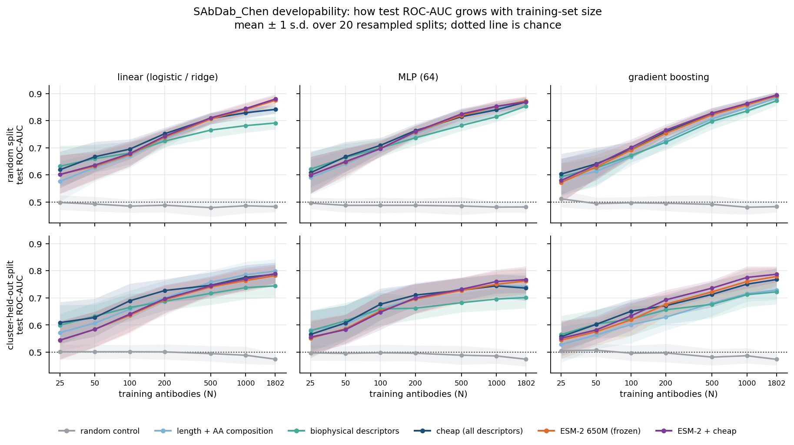
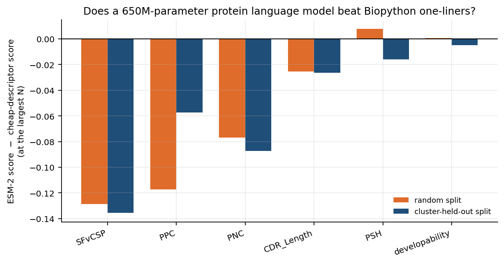
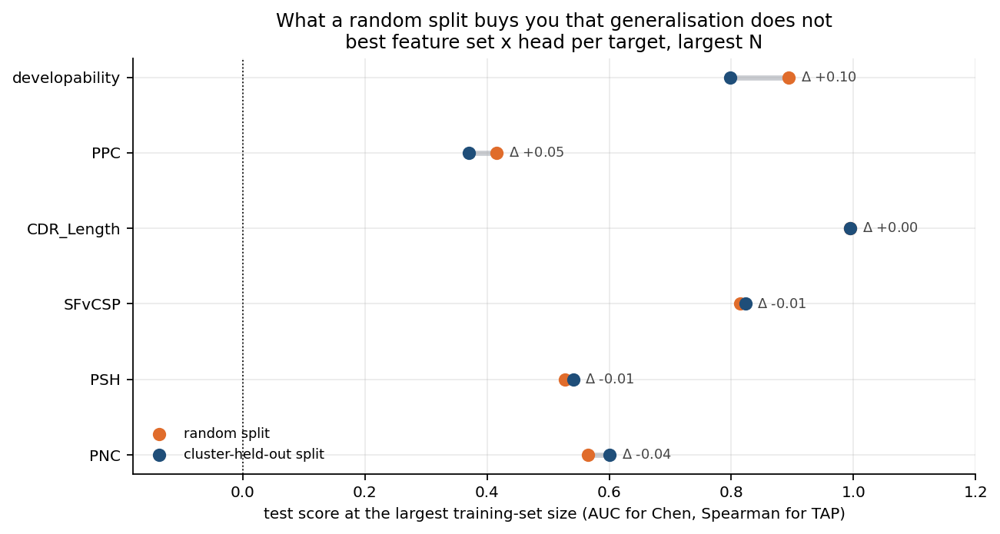
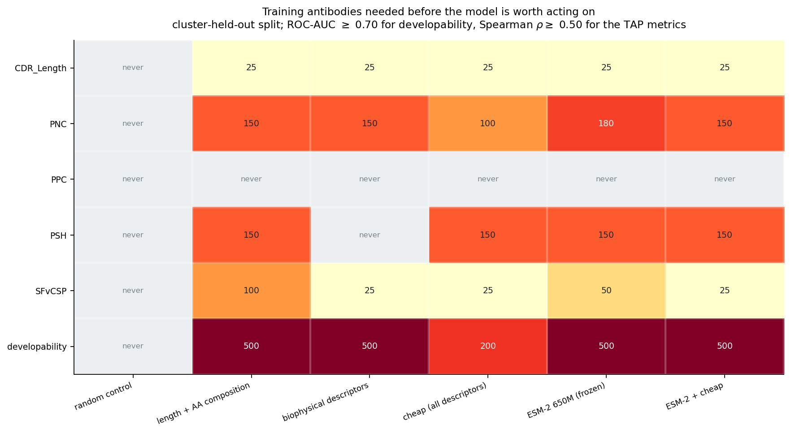
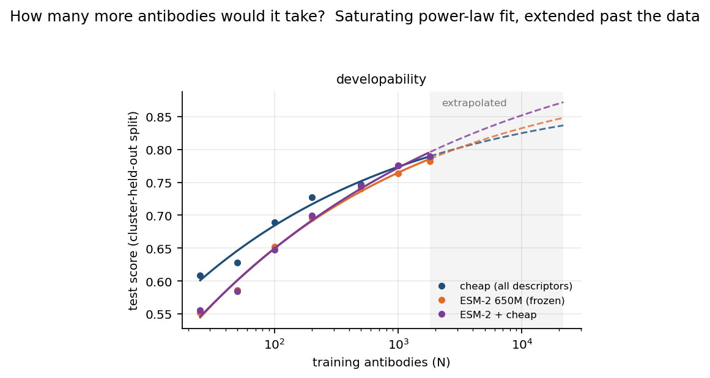
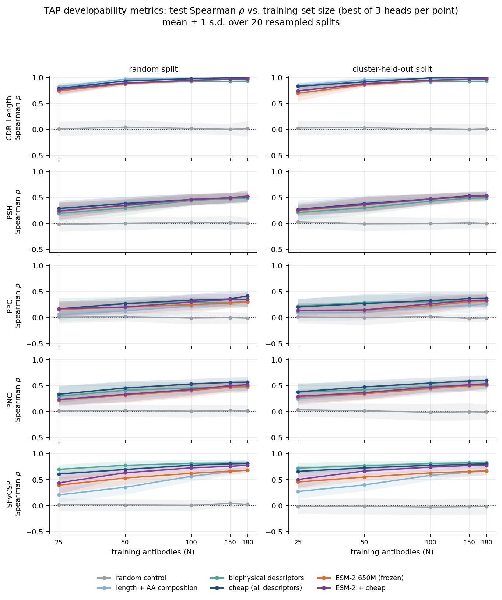

# How much data do you actually need?

**A low-N benchmark for antibody property prediction.**

Wet-lab measurements are expensive, so antibody property models get fitted on dozens to
hundreds of examples, not millions. Almost nobody benchmarks that regime honestly. This
repository takes frozen ESM-2 embeddings, trains simple heads on two public antibody
developability datasets, and systematically varies how much training data the heads get,
against baselines cheap enough to be embarrassing.

23,040 fits: 2 datasets, 6 targets, 6 feature sets, 3 heads, up to 7 training-set sizes,
2 split types, 20 seeds each.



## What I found

**Frozen protein-language-model embeddings do not beat Biopython one-liners in the low-N
regime, and on a leakage-free split they barely beat them anywhere.** At N=25 on SAbDab_Chen
developability, ESM-2 650M under a linear head scores 0.066 ROC-AUC *below* a set of 81
hand-computed descriptors, paired across seeds, p < 0.0001. At N=100 it is still 0.053 behind.
The gap closes around N=500 and ESM-2 pulls level; on a random split it edges ahead by
0.033 AUC at the full 1,806 antibodies. On a cluster-held-out split that final advantage is
gone: −0.005 AUC, p = 0.62. On all five TAP regression targets, the cheap descriptors win
outright under both split types. The one place ESM-2 clearly helps is under a 64-unit MLP on
the largest cluster-held-out training set, +0.026 AUC, p = 0.0009, which is a narrow enough
win to be worth naming precisely rather than rounding up to "embeddings work".

**The choice of split matters more than the choice of features.** 65% of a random
SAbDab_Chen test set has an antibody in training that is at least 80% identical to it. Holding
out whole identity clusters instead drops the headline number from 0.894 to 0.799 ROC-AUC.
That 0.096 gap is larger than the spread between the best and worst *informative* feature sets
at any N, which peaks at 0.057, and much larger than the gap between a 2,560-dimensional
language model and 42 amino-acid frequencies. The same
experiment on TAP shows a gap of roughly zero, because TAP is 241 distinct therapeutics with
almost no near-duplicates. So the leakage tax is a property of the dataset, not a constant, and
the only way to know which situation you are in is to cluster your panel and look.

## The three numbers worth taking away

### 1. Where the language model actually helps



Seed-paired difference at the largest training-set size, ESM-2 minus cheap descriptors, within
each head. Negative means the Biopython features won.

| target | split | head | ESM-2 − cheap | p |
|---|---|---|---:|---:|
| developability | random | linear | **+0.033** | <0.0001 |
| developability | cluster | linear | −0.005 | 0.62 |
| developability | cluster | MLP | **+0.026** | 0.0009 |
| SFvCSP | cluster | linear | −0.136 | <0.0001 |
| PNC | cluster | linear | −0.087 | 0.0001 |
| PSH | cluster | linear | −0.016 | 0.17 |
| CDR_Length | cluster | linear | −0.027 | <0.0001 |

Full table in [`results/paired_esm_vs_cheap.csv`](results/paired_esm_vs_cheap.csv).

### 2. The honesty tax



| | random split | cluster-held-out | gap |
|---|---:|---:|---:|
| SAbDab_Chen developability (AUC) | 0.894 | 0.799 | **+0.096** |
| TAP PPC (ρ) | 0.416 | 0.370 | +0.046 |
| TAP CDR_Length (ρ) | 0.995 | 0.994 | +0.001 |
| TAP SFvCSP (ρ) | 0.815 | 0.823 | −0.008 |
| TAP PSH (ρ) | 0.528 | 0.541 | −0.013 |
| TAP PNC (ρ) | 0.565 | 0.601 | −0.036 |

A detail that took me by surprise: clustering the *whole* Fv at 80% identity puts 1,173 of
2,409 SAbDab antibodies into a single cluster. Antibody frameworks are conserved by
construction, so the naive CD-HIT threshold you would use on a normal protein set is
meaningless here. The split used throughout links two antibodies if they are ≥90% identical
over the Fv **or** ≥80% identical over their concatenated CDR3 loops, which leaves 971
clusters and zero near-duplicate leakage.

### 3. How many antibodies you need before any of this is worth acting on



Two of TAP's five metrics never get there. Patches of positive charge (PPC) tops out around
ρ = 0.37 with everything I threw at it, and patches of surface hydrophobicity (PSH) needs 150
of the 180 available training antibodies to clear ρ = 0.50. Meanwhile total CDR length is
solved at N=25 by any feature set, for an uninteresting reason: chain length alone correlates
with it at Spearman 0.996. One of the five headline TAP targets is a giveaway, and a benchmark
that reports a mean across all five without saying so is flattering itself.

### And how many more it would take



Fitting a saturating power law to the cluster-held-out curve and inverting it: reaching
0.80 AUC on SAbDab developability needs roughly 2,800 antibodies, about 1.5× what exists in
the dataset. Reaching 0.85 needs somewhere in the tens of thousands, with an uncertainty
wide enough that the honest answer is "not by collecting more of this kind of data".

## The TAP curves in full



## Method

**Features.** Six sets, all evaluated identically.

| set | dimensions | what it is |
|---|---|---|
| `random` | 64 | Gaussian noise, one fixed draw per antibody. The floor. |
| `aac` | 42 | chain length plus the 20 amino-acid frequencies, per chain |
| `biophys` | 28 | Biopython global descriptors per chain (net charge at pH 7 and 5.5, GRAVY, aromaticity, pI, instability, secondary-structure fractions, extinction coefficient) plus six whole-Fv terms |
| `cheap` | 81 | `aac` + `biophys` + motif-anchored CDR3 lengths and their composition |
| `esm2` | 2560 | frozen `facebook/esm2_t33_650M_UR50D`, mean-pooled over residues, heavy \|\| light |
| `esm2+cheap` | 2641 | concatenation of the two |

The `cheap` set deliberately includes the product of heavy- and light-chain net charge, which
is close to the definition of TAP's charge-symmetry target. It is the single strongest
coefficient in that model and it is why the descriptors beat a language model by 0.14 there.
Hiding that would make the benchmark dishonest; the point is that domain knowledge wins
exactly where a physical descriptor already encodes the answer.

**Heads.** Linear (L2 logistic regression for classification, ridge for regression, penalty
chosen by inner cross-validation on the training subsample only), a 64-unit MLP, and histogram
gradient boosting. Every head sits behind a `StandardScaler` fitted inside the pipeline, so
nothing from the test set reaches the fit.

**Protocol.** For each of 20 seeds, partition into a training pool and a test set, then draw
*nested* subsamples of size N from the pool: the N=25 set is a subset of the N=50 set, so the
curve is paired rather than independent at every point. The test set is fixed per seed and
never subsampled, so every point on a curve is scored on exactly the same antibodies. Curves
show the mean over seeds with a one-standard-deviation band. Comparisons between feature sets
use a Wilcoxon signed-rank test over the 20 paired seeds, within a head; comparing best-of-head
envelopes instead would smuggle in a selection effect.

**Data.** [SAbDab_Chen](https://tdcommons.ai/single_pred_tasks/develop/) is 2,409 antibodies
with a binary developability label, 20% positive. [TAP](https://arxiv.org/pdf/2102.09548) is
241 antibodies with five continuous metrics. Both are heavy plus light chain sequence only,
so no structure handling.

## Things I would not claim from this

- **CDR annotation is regex, not ANARCI.** The CDR3 loops are pulled out with the classical
  motif anchors, the framework-3 cysteine through to the J-segment `WGxG` / `FGxG`. It fires on
  90% of heavy chains and 93% of light chains in SAbDab and its lengths track TAP's own total-CDR
  metric at Spearman 0.66. Good enough to be a feature, not good enough to be a measurement.
- **One embedding model.** ESM-2 650M only, mean-pooled. An antibody-specific model
  (AntiBERTy, AbLang, IgBert) is trained on exactly the redundancy that makes this problem
  hard and might behave differently. That is the obvious next experiment, not a footnote.
- **Mean pooling throws away where things are.** A hydrophobic patch is a local, spatial
  property, and averaging over residues is the cheapest possible readout of a per-residue
  model. Part of what this benchmark measures is how much that costs.
- **The extrapolations are extrapolations.** Seven points and three free parameters. The
  fitted ceiling is capped a fixed margin above the best score observed, because otherwise it
  parks at 1.0 and predicts absurd sample sizes. Anything past the largest measured N is a
  shaded, dashed region on the figure for a reason.
- **SAbDab_Chen's label is computational.** It comes from a structure-based developability
  pipeline, not from a bench. It is a proxy for a proxy.

## What I would do next with real wet-lab data

1. **Spend the first analysis on the split, not the model.** The largest single effect in this
   benchmark is not the feature set, it is whether near-duplicates straddle the train/test
   boundary. An in-house panel built by affinity maturation around a few leads is far more
   redundant than SAbDab, so the effect should be larger, not smaller.
2. **Report the cheap baseline in every model review.** Net charge, GRAVY and CDR length take
   an afternoon and they are the number a language model has to beat. Below N≈500 here they
   usually win, and where they lose it is by a margin worth quantifying rather than assuming.
3. **Use the learning curve to price the next experiment.** The useful output is not
   "AUC 0.80", it is "another 1,000 antibodies buys about 0.01 AUC on a held-out cluster".
   That is a number a program lead can trade against plate cost, and it falls straight out of
   the power-law fit.
4. **Test the prediction this makes.** The pattern here is that descriptors win exactly where
   a physical descriptor encodes the target, and the language model closes the gap where none
   exists. On an assay with no closed-form biophysical proxy (titre, expression,
   polyreactivity) frozen embeddings should do relatively better. That is directly testable.
5. **Only then consider fine-tuning.** Frozen embeddings under a cluster-held-out split are
   the honest floor. Fine-tuning should have to beat that floor on a held-out cluster before
   anyone spends a GPU week on it.

## Reproducing

```bash
make setup
make all
```

Embedding takes about four minutes on an M-series laptop, one on a T4. The sweep is the long
pole at about an hour on twelve cores; `make quick` runs a three-seed sanity version in two
minutes. Everything except `data/` is committed, so the figures above render without running
anything.

## Layout

```
src/lown/     data loaders, features, embeddings, splits, heads, experiment, plots, scaling
scripts/      one numbered script per phase (see scripts/README.md)
results/      every table, including the 23,040-row per-fit sweep output
figures/      every figure in this README
notebooks/    analysis walkthrough over the saved results
```

## Licence and data

Code under MIT. Both datasets come from
[Therapeutics Data Commons](https://tdcommons.ai/single_pred_tasks/develop/) and are
CC-licensed. TAP is from Raybould et al., *Five computational developability guidelines for
therapeutic antibody profiling*, PNAS 2019; SAbDab_Chen from Chen et al., 2020.
